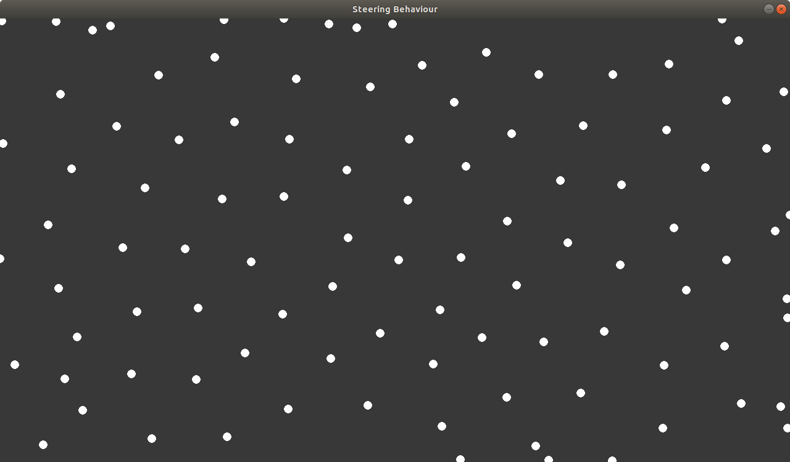
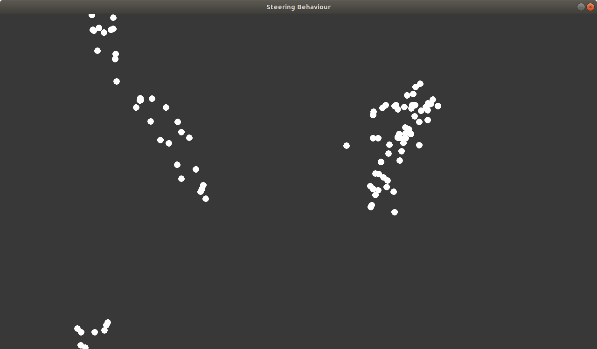
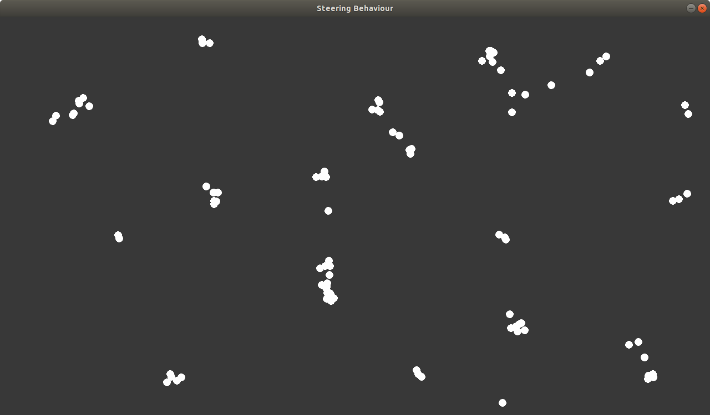

# JV-SteeringBehaviors

## Fonctionnel

Le but de ce projet est de simuler la fluidité d'un mouvement de foule. Ce mouvement peut être retrouvé par exemple dans les bancs de poissons ou les volées d'oiseaux. Cette simulation est basée sur le travail théorique de Craig Reynolds : https://www.red3d.com/cwr/boids/.
Vous retrouverez donc dans cette implémentation en Python la simulation des 3 comportements identifés par le chercheur : la séparation, l'alignement et la cohésion. Ainsi le programme finale combinera ces 3 forces afin de simuler un comportement de foule.

### Séparation


### Alignement


### Cohésion


### Installation

Afin d'installer ce projet, il vous suffit de lancer la commande suivante dans un environnement `python 3.6` :

```
$ make init
```

Afin de lancer le programme : 

```
$ python src/game.py
```